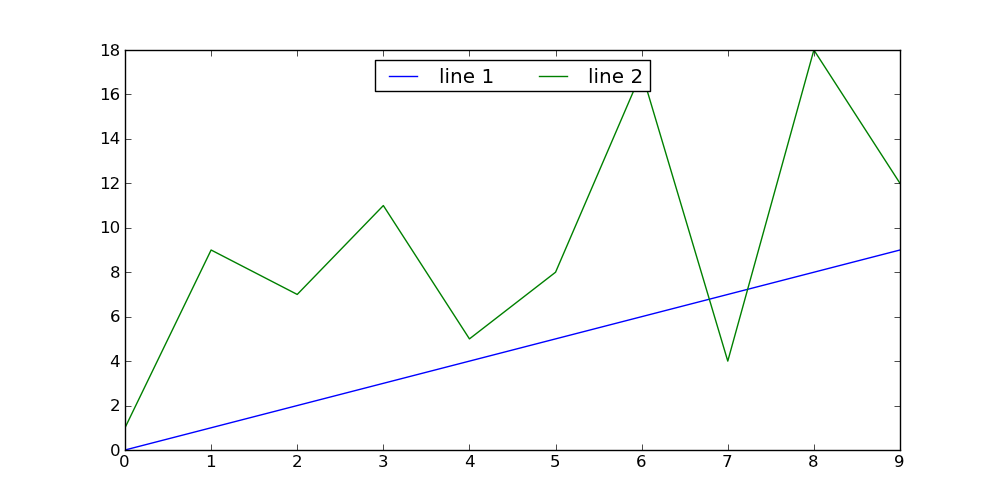
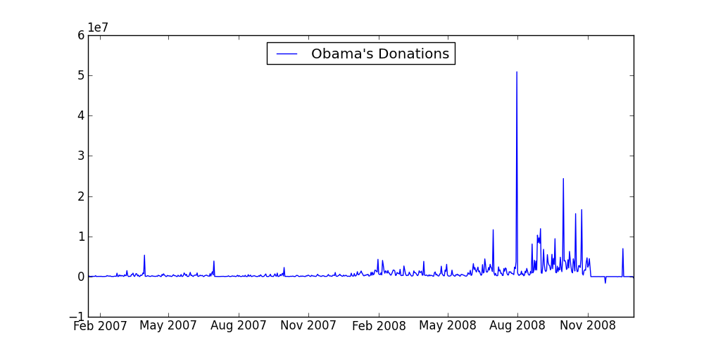
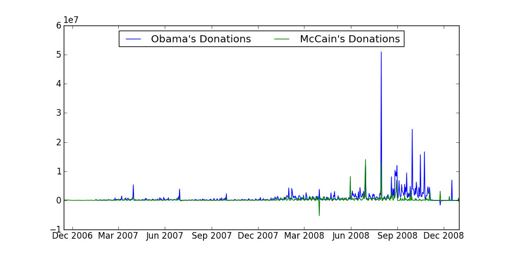
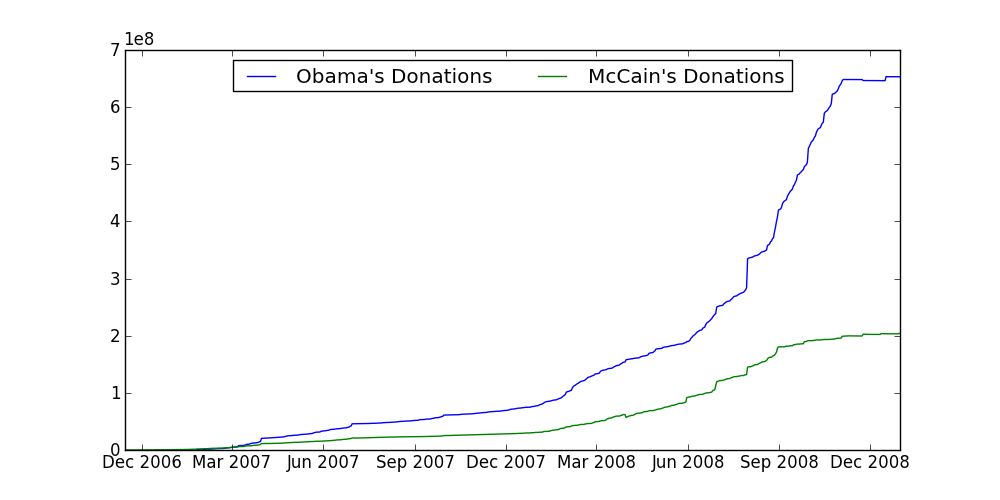

# Day 1: Let's play with some data!

Today we will analyze the presidential campaign contributions dataset. We
will go through the full process of downloading a new dataset, the
initial steps of understanding the data, visualizing it, coming up
with hypotheses, and exploring the dataset.  Hopefully, you'll learn
something new about presidential elections.

A lot of other organizations have analyzed the data:

* [The FEC](http://fec.gov/disclosurep/pnational.do) is the organization that published the dataset, but also offers basic summaries of the data.
* [Pitch Interactive](http://www.pitchinteractive.com/election2008/) has some pretty sweet visualizations of the data.
* [More from Pitch Interactive](http://www.pitchinteractive.com/election2008/jobarcs.html)
* [Donor Occupations](http://neoformix.com/2008/ObamaMcCainDonorOccupations.html)

These visualizations are beautiful but high level overviews, which
tend to hide interesting details.  We have our own questions, and
we'll answer some of them today.  We'll provide the commands and code to
initially explore the data, and ask you to further analyze the data in
the exercises.

## First Steps

We assume that you have already [downloaded the
dataset](../day0/index.html).  We need to first unzip the file and rename
it to something meaningful:

    > unzip P00000001-ALL.zip
    > mv P00000001-ALL.txt donations.txt

Lets see how much data we are dealing with.  The word count (`wc`) command will tell us the number of lines in this file:

	> wc -l donations.txt
	4938656

Let's take a quick look at the file.  `head` prints the first N lines in a file.  

	> head -n3 donations.txt	cmte_id,cand_id,cand_nm,contbr_nm,contbr_city,contbr_st,contbr_zip,contbr_employer,contbr_occupation,contb_receipt_amt,contb_receipt_dt,receipt_desc,memo_cd,memo_text,form_tp,file_num
    C00420224,"P80002983","Cox, John H","BROWN, CHARLENE","EAGLE RIVER","AK","99577","","STUDENT",25,01-MAR-07,"","","","SA17A",288757
    C00420224,"P80002983","Cox, John H","KELLY, RAY","HUNTSVILLE","AL","35801","ARKTECH","RETIRED",25,25-JAN-07,"","","","SA17A",288757

On line 1 we see the names of each field in the file, and the data
starts from line 2.  It's in a format called `CSV`, or comma-separated
values, where each row contains a new set of field values separated by
commas.

If we take a look at the [file format
description](ftp://ftp.fec.gov/FEC/Presidential_Map/2012/DATA_DICTIONARIES/CONTRIBUTOR_FORMAT.txt)
on the fec.gov website, it specifies that

	The text file is comma delimited and uses double-quotation marks as the text qualifier.

The file contains information about the candidate, the donor's city, state, zip code, employer and occupation information, as well as the amount donated.  In addition it contains the date of the donation, 

Let's write a script to read and print each donation's date, amount
and candidate.  Python comes with a `csv` module that helps read CSV
files.

	import csv,sys,datetime
	reader = csv.DictReader(open(sys.argv[1], 'r'))
	
	for row in reader:
	    name = row['cand_nm']
	    datestr = row['contb_receipt_dt']
	    amount = row['contb_receipt_amt']
	    print ','.join([name, datestr, amount])

DictReader assumes that the first line are the names of the fields,
and creates a dictionary for each row of `fieldname->value` pairs.
Copy the above code into a file (say `exercise1.py`) in the same
directory as `donations.txt`, and run `python exercise1.py
donations.txt`.  This will make `donations.txt` be the first argument
to the program (`sys.argv[1]`), which will be read and printed line by
line.  We'll only print the name, date, and amount of the contribution
for now.

### Introducing `matplotlib`

We will be using `matplotlib` in the rest of the course, and work with
it extensively in day 2.  The following code is a crash course on how
to graph a line in `matplotlib`.

	# pyplot is the plotting module
	import matplotlib.pyplot as plt
	import random
	
	# generate the data
	xs = range(10) # 0...9
	ys1 = range(10) # 0...9
	ys2 = [random.randint(0, 20) for i in range(10)] # 10 random numbers from 0-19
	
	# create a 10-inch x 5-inch figure
	fig = plt.figure(figsize=(10,5))

	# draw a line graph
	plt.plot(xs, ys1, label='line 1')
	plt.plot(xs, ys2, label='line 2')

	# create the legend
	plt.legend(loc='upper center', ncol = 4)

	# finally, render and store the figure in an image
	plt.savefig('twolines.png', format='png')

`plt.plot()` takes a list of x and a list of y values, and draws a line between every pair of (x,y) points.  The line is drawn on the most recently created figure.

`plt.legend()` draws the legend in the figure.  There are a bunch of other common chart objects like x-axis labels that `matplotlib` supports.

In the final line, `plt.savefig()` saves the figure to a file called
`twolines.png` in the directory we ran the script.  Try it out!  You should see something like

### Sampling The Data

The dataset is quite large, and processing the full dataset can be pretty slow.  It is often useful to sample the dataset and try things out on the sample before doing a complete analysis of all of the data.  The following is a script that samples the donations dataset.  It will print 1 out of every 1000 donations (or roughly 5000 total donations):

	import sys
	
	with file(sys.argv[1], 'r') as f: 
		i = 0
		for line in f:
	        if i % 1000 == 0:
	            print line[:-1]
	        i += 1

The line `print line[:-1]` prints the entire line except its last
character to the screen.  Why skip the last character?  Because each
line ends in a carriage return, and `print` will add one for us.  We
don't want a space between each line!

This script will print every thousandth line of whatever file you pass
in as an argument to the screen.  To create a new file, use the `>`
standard output rediretor.

         python exercise3.py donations.txt > donations_sampled.txt

We will be analyzing Obama vs McCain data, so you can modify this code to create a file that only contains donations for McCain and Obama.  That way later analysis will run faster.

## Plotting The Data

We learned how to iterate and extract data from the dataset, and how to plot lines, so we will now combine the two  to plot Obama's campaign contributions by date.  We will compute the total amount of donations for each day, and use `matplotlib` to create the charts.

    from collections import defaultdict
    import  matplotlib.pyplot as plt
    import csv, sys, datetime
	
    reader = csv.DictReader(open(sys.argv[1], 'r'))
    
    obamadonations = defaultdict(lambda:0)
    
    for row in reader:
        name = row['cand_nm']
        datestr = row['contb_receipt_dt']
        amount = float(row['contb_receipt_amt'])
        date = datetime.datetime.strptime(datestr, '%d-%b-%y')
    
        if 'Obama' in name:
            obamadonations[date] += amount
    
    
    # dictionaries 
    sorted_by_date = sorted(obamadonations.items(), key=lambda (key,val): key)
    xs,ys = zip(*sorted_by_date)
    plt.plot(xs, ys, label='line 1')
    plt.legend(loc='upper center', ncol = 4)
    plt.savefig('/tmp/test.png', format='png')

A few notes about the code 

* `defaultdict` is a convenience dictionary.  When we use a regular dictionary, it throws an error when we access a key that doesn't exist:
 
	`>>> d = {}`  
	`>>> d['foo']`  
	`Traceback (most recent call last):`  
	`  File "<stdin>", line 1, in <module>`  
	`KeyError: 'foo'`  
  
    We provide `defaultdict` a function to call and return if the key doesn't exist.  This is nice because we can assume a default value.  It is otherwise used as a normal python dictionary: 
	
	`>>> d = collections.defaultdict(lambda:0)`  
	`>>> d['foo']`  
	`0`  
	`>>> d['bar'] += 1`  

* We parse the dates using the `datetime` module's `strptime` function.  The string `%d-%b-%y` is called a [date format string](http://docs.python.org/library/datetime.html#strftime-strptime-behavior).

* In the loop that reads the data, we record the total donation amount for each date.  

* Finally, we need to sort the data in `obamadonations` by the date (the key).  `sorted(l, key=f)` returns a sorted copy of `l` and calls `f` to extract the key to use for comparison.

* `zip(*pairs)` then unzips the list of pairs into two lists.

You should see something like this:

Great!  It's interesting to see a spike in donations on August 2008 -- does it relate to the [democratic party nomination speech](http://elections.nytimes.com/2008/president/conventions/videos/20080828_OBAMA_SPEECH.html) he gave on August 28th?  At this point a reporter may try to understand some of the spikes in the graph.  

**But wait!** There's a really weird _dip_ in his donations in the lower right corner.  How does someone give negative donations?  The next part will investigate this further.

<!--Notice that the graph doesn't have any labels, and the y-axis is at an incomprehensible scale.  Don't worry about it for today, we'll go into details on customizing graphs tomorrow.-->

## The Case of the Negative Donation

The first thing we should do is look at some of the data where the donation amount is negative and see if there's anything interesting.  We can modify our existing code.

	import csv,sys,datetime
	reader = csv.DictReader(open(sys.argv[1], 'r'))
	
	for row in reader:
	    name = row['cand_nm']
	    datestr = row['contb_receipt_dt']
	    amount = float(row['contb_receipt_amt'])
		if amount < 0:
			line = '\t'.join(row.values())
			print line

Note that we cast `amount` into a float.  The CSV module returns
 strings, so its our job to cast the data into the proper type.

If you scan through the output, you'll see data such as:

	C00430470	DARIEN	RETIRED	McCain, John S	SA17A	P80002801	068202003		VAN MUNCHING, LEO MR. JR.	02-AUG-07	CT	X	REATTRIBUTION TO SPOUSE	315387	REATTRIBUTION TO SPOUSE	-2300
	
	C00430470	LOS ANGELES	EXECUTIVE	McCain, John S	SA17A	P80002801	900492125	A.E.G.	LEIWEKE, TIMOTHY J. MR.	30-APR-08	CA	X	REFUND; REDESIGNATION REQUESTED	364146	REFUND; REDESIGNATION REQUESTED	-2300

Lots of text, but "REDESIGNATION TO GENERAL" and "REATTRIBUTION TO SPOUSE" pop out as pretty strange.

It turns out that "redesignations" and "reattributions" are [perfectly normal](http://www.fec.gov/pages/brochures/contrib.shtml#Excessive_Contributions).  If a donation by person A is excessive, the part that exceeds the limits can be "reattributed" to person B, meaning that person B donated the rest to the campaign.  Alternatively, the excess amount can be redesignated to another campaign in the same party.  So a donation to Obama could be redesignated to a poor democrat in Nebraska.

What's fishy is "REATTRIBUTION TO SPOUSE."  A quick google search gives a potential theory: that this is a tactic to [hide campaign contributions](http://irregulartimes.com/index.php/archives/2010/11/28/corporate-executives-pawn-off-tim-pawlenty-contributions/) from CEOs.  A CEO will donate money, which will be reattributed (refunded) to the CEO's spouse.  Then the humble spouse will turn around and donate the money to the candidate.  In this way, it's hard for a casual browser to notice that the candidate is backed by a company's CEOs. 

# Exercise 1: Plot Obama vs. McCain

So far we have only plotted Obama's campaign donations.  Modify the script to also plot McCain's donations on the same chart.  It should look something like:

Whoa whoa whoa, what was McCain up to March 2008?  That's a whole lot of negative donations!  We'll deal with that in a few exercises.

# Exercise 2: Cumulative Graphs

Word on the street says that Obama's donations eclipsed McCain's donations.  Let's see if that's true.  Plot the cumulative donations (for a given date, plot the total donations up to that date).  It should look something like:

# Exercise 3: Understand "Reattribution to Spouse"

Let's now filter the contributions to only see the cumulative "reattribution to spouse" donations.  Which candidate do the dark, hooded CEOs prefer?  

You will need to find the name of the field that contains the "reattribution" text, and filter on that field.  Depending on how you filter it, you may get different results.  Try out a few ways to see what happens.

# Exercise 4: Pause and Think

It's time for a reality check.  If you saw the graph in the previous exercise, you would think "That's a lot of negative donations!  This candidate is really sneaky."  Don't believe that just yet.  Re-plot the **ratio** between each candidate's cumulative "reattribution to spouse" donations and that candidate's cumulative overall donations.  That changes our offenders quite a bit.

**Key Lesson: don't automatically trust charts in the wild.  It's easy to make a chart say whatever you want by selectively leaving out data!**

# Done!

Congrats!  You are now a data sleuth.  To recap the process we just went through we:

1. Took a quick look at the data using `head` to get a sense of what we're dealing with.  We also figured out the format of the data.  This is usually important, because the fields are otherwise somewhat non-sensical!
1. Create a quick, initial visualization of some of the data fields and see if there are interesting trends.
1. Listen to your hunch, and form a hypothesis around it
1. Figure out why the trend exists
1. Filter the dataset to the "interesting portion" and go to step 2

Tomorrow, we will dive deeper into `matplotlib`'s visualization facilities, and further analyze the data using different visualizations.

## Related Datasets

If you are interested more campaign finance data, you can also [download the campaign expense data](ftp://ftp.fec.gov/FEC/Presidential_Map/2008/P00000001/P00000001-ALL.zip) from the same website, if you click the "expenditures" tab in the right table.

# Feedback
<iframe src="https://docs.google.com/spreadsheet/embeddedform?formkey=dExoSTVxbUh6SGVhdmhiYlhTVFItV0E6MQ" width="760" height="962" frameborder="0" marginheight="0" marginwidth="0">Loading...</iframe>
