# Day 2

## Overview

Today, we will do more with `matplotlib`.

* bar graphs
* line graphs
* box plots (will be useful tomorrow)
* scatter plots
* [choropleth plots](http://en.wikipedia.org/wiki/Choropleth_map) (map plots)

We will also learn to

* create figures with multiple sub-figures (called subplots)
* customize labels, colors, error bars etc.

In the exercises, we will use this to further visualize and analyze the campaign donations data.

`matplotlib` is quite powerful, and is intended to emulate matlab's visualization facilities.   We will give you a basic understanding of how plotting works, which should be enough for a majority of the charts that you will want to create.

## Plotting Large Datasets

The dataset that we are working with is fairly large for a single computer, and it can take a long time to process the whole dataset, especially if you will process it repeatedly during the labs.

Use the sampling technique we discussed in yesterday's lab!  You can change the sampling frequency (`1000` yesterday) to change the size of the sample.  Use `100` as a starting point, but realize the graphs we show are with sampling set to `1` (all rows are included).

## Introduction

Visualizations are used to succinctly and visually describe different parts or different interpretations of your data.  They give the reader, who is not necessarily an expert in the dataset, an intuition of trends or relationships.

I typically use visualizations for two purposes:

1. **Exploring**: Quickly viewing the dataset to spot outliers and trends and form hypotheses.
1. **Storytelling**: Illustrating a piece of data that I've cleaned, and processed in order to make a point.

### Figure and Subplots

The package we will be using is `matplotlib.pyplot`.  It provides a lot of shorthands and defaults (we used some of them yesterday when making line charts), but today we will do things the "right way".  

A `figure` is the area that we will draw in.  We can specify that it is 50 inches wide and 30 inches tall.

	import matplotlib.pyplot as plt
	fig = plt.figure(figsize=(50, 30))

It is common to create multiple subfigures or `subplots` in a single figure.  `fig.add_subplot(nrows, ncols, i)` tells the figure to treat the area as a nrows x ncols grid, and return an [Axes](http://matplotlib.sourceforge.net/api/axes_api.html) object that represents the i'th grid cell.  You will then create your chart by calling methods on object.  It helps me to think of an Axes object as a subplot.

	subplot1 = fig.add_subplot(2, 3, 1)
	subplot2 = fig.add_subplot(2, 3, 2)

For example, the above code creates a figure with the following layout.  The black box is the area of the figure, while each blue box is a subplot in a 2x3 grid.  The number in a blue box is the subplot's index.  

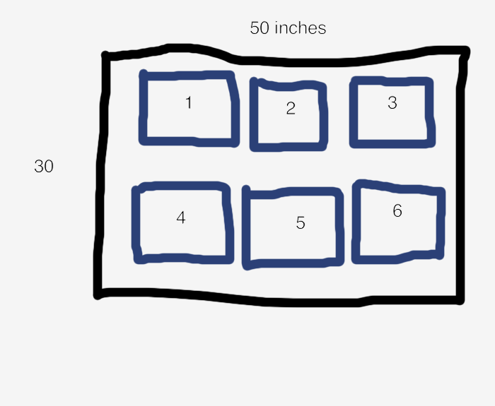

It's important to mention that `add_subplot` does not actually create a grid, it just finds the area in an imaginary grid where a `subplot` should be and return an object that represents the area.  Thus it is possible to do draw on overlapping `subplots`.  Be careful!

	fig.add_subplot(2, 3, 1)
	fig.add_subplot(2, 1, 1)

When you read matplotlib code on the internet, you will often see a shorthand for creating subplots when the subplot index, number of rows, and number of columns are all less than 10.  `fig.add_subplot(xyz)` returns the z'th subplot in a x by y grid.  So `fig.add_subplot(231)` returns the first subplot in a 2x3 grid.  

### How Drawing Works

The functions that we will be using to create charts are simply convenience functions that draw and scale points, lines, and polygons at x,y coordinates.  Whenever we call a plotting method, it will return a set of objects that have been added to the subplot.  For example, when we use the `bar()` method to create a bar graph, `matplotlib` will draw rectangles for each bar, and return a list of `rectangle` objects so that we can manipulate them later (e.g., in an animation).

As you use `matplotlib`, keep in mind that:

* Many of the plotting functions will ask you to specify things similar to x,y coordinates / offsets.
* When you call a drawing function, it won't rearrange the layout of what was drawn before.  It simply draws the pixels **on top of** what has been drawn before.
* You are ultimately adding points, lines and polygons on top of one another.

# Let's Plot Some Graphs!

Let's get to drawing graphs!  By the end of this tutorial, you will have experience creating bar charts, line charts, box plots, scatter plots, and choropleths (map plots).   We will walk you through how to create a figure similar to

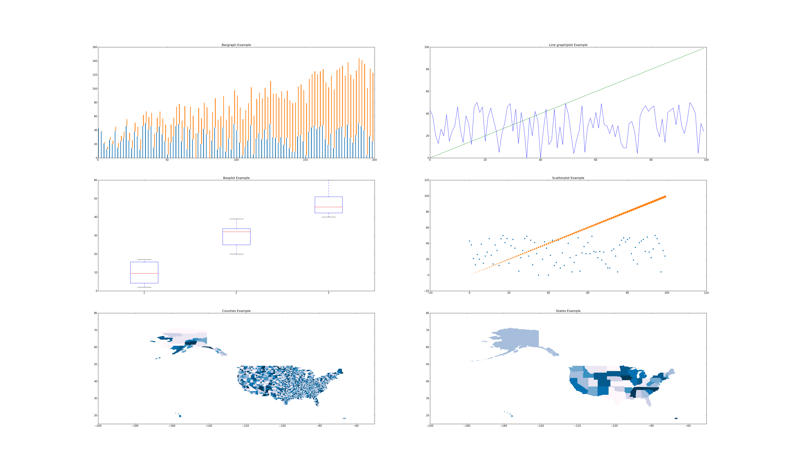

This figure creates subplots in a 3x2 grid, so let's first setup the figure and generate two sets of data.  Both sets have the same x values, but different y values.  Think "obama" and "mccain" from yesterday :)

	import matplotlib.pyplot as plt
	import random
	random.seed(0)

	fig = plt.figure(figsize=(50, 30))
	
	N = 100
	xs = range(N)
	y1 = [random.randint(0, 50) for i in xs]
	y2 = range(N)

### Bar Plots [documentation](http://matplotlib.sourceforge.net/api/axes_api.html#matplotlib.axes.Axes.bar)

Bar plots are typically used when you have categories of data that you want to compare.  The `subplot` function is:

`subplot.bar(left, height, width=0.8, bottom=None, **kwargs)`

The bar plot function either takes a single left and height value, which will be used to draw a rectangle whose left edge is at `left`, and is `height` tall:

	subplot.bar(10, 30) # left edge at 10, and the height is 30.

or you can pass a list of lefts values and a list of height values, and it will draw bars for each pair of left,height value.  For example, the following will create three bars at the x coordinates 10, 20 and 30.  The bars will be 5, 8, 2 units tall.

	subplot.bar([10, 20, 30], [5, 8, 2])

`matplotlib` will automatically scale the x and y axes so that the figure looks good.  While the numbers along the x and y axes depend on the values of `left` and `height`, the sizes of the bars just depend on their relative values.  That's why we've used the word "unit" instead of "pixel".

The `width` keyword argument sets width of the bars  It can be a single value, which sets the width of all of the bars, or a list that specifies the list of each bar.  Set it relative to the differences of the `left` values.  For example, the code above sets each bar 10 units apart (`left=[10, 20, 30]`), so I would set `width = 10 / 2.0`.

The `bottom` keyword argument specifies the bottom edge of the bars. 

	subplot.bar([10, 20, 30], [5, 8, 2], width=[5,5,5], bottom=[5, 10, 15])

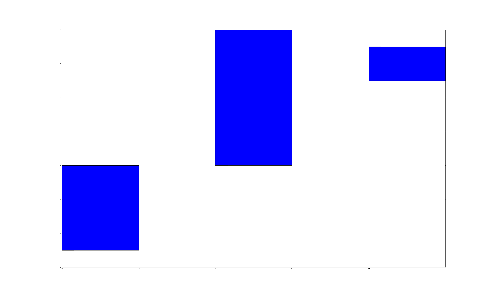

What if you want to draw 2 sets of bars?  We simply call `subplot.bar()` multiple times.  However, we would need to set the `left` argument appropriately.  If we used the same `left` list for all the calls, then the bars would be drawn on top of each other.  

What if we want to shift the second set of bars by `width` units?  One way to do this is to turn `left` into a `numpy` list.  Numpy arrays let us perform math operations (e.g., `+,-,/,*`) on every element in the array, and `matplotlib` methods also accept `numpy` lists.  So `left+width` adds `width` to every element in `left`, which serves to shift the second set of bars to the right by `width` units.  The following code should reproduce the first subplot in the figure.

	import numpy as np
	left = np.arange(len(xs))
	width = 0.25

	subplot = fig.add_subplot(3,2,1)
	subplot.bar(left, ys, width=width)
	subplot.bar(left+width, ys2, width=width, bottom=ys)

You can further customize your bar charts using the following popular keyword arguments:

* `color='blue'`: set color to a hex value ("#ffffff"), a common color name ("green"), or a shade of grey ("0.8").
* `linewidth=1`: the width of the bar's border.  set it to `0` to remove the border.
*  `edgecolor='blue'`: set the color of the bar's border.
* `label='a name'`: give a set of bars a name.  Later, we will teach you how to create legends that will display the labels.

For example, the following would draw a set of red bars:

    subplot.bar(left, ys, color='red')

### Line Plots [documentation](http://matplotlib.sourceforge.net/api/axes_api.html#matplotlib.axes.Axes.plot)

Line plots are typically used when graphing data with two continuous dimensions.  In addition, drawing the line implies that we can extrapolate values between adjacent points on the line.  This is a key difference between line plots and scatter plots.

`subplot.plot(xs, ys, **kwargs)`

The `plot` command draws a line graph.  It takes a list of x values and y values, and draws a line between every adjacent pair of points.  Try it out using the data in the previous section.

`subplot.plot(xs1, ys1, xs2, ys2, ...)` is a convenient shorthand for:

    subplot.plot(xs1, ys1)
    subplot.plot(xs2, ys2)
    ...

To reproduce the line graph, we can simply write

    subplot = fig.add_subplot(322)
    subplot.plot(xs, ys1, xs, ys2)

You can also customize the lines using the keyword arguments:

* `color='green'`: same as `color` for bar graphs
* `marker=None`: specify the marker to draw at each point.  I commonly use `'*', '+', '.'` or `'o'`.  Set it to `None` to not draw markers.  The documentation has a full list of the available markers.
*  `label='a name'`: give a line a name.  I usually call `plot()` for each line if I want to give each one a name.

### Box Plots [documentation](http://matplotlib.sourceforge.net/api/axes_api.html#matplotlib.axes.Axes.boxplot)

`boxplot(data)`

Boxplots are used to summarize and compare groups of numerical data.  Each box summarizes a set of numbers and depicts 5 parameters:

<b>***NOTE***</b> The words we are about to use might seem foreign to you.  We will teach boxplots in depth tomorrow.  We are just introducing how to draw box plots today, and will use them a whole lot tomorrow.

* The smallest number
* The lower quartile
* The median
* The upper quartile
* The largest observation

`subplot.boxplot` will automatically compute these values, and also ignore numbers that it thinks are outliers.  Don't worry about when and why they are used -- we will discuss that tomorrow.  Just know that **one box summarizes a set of numbers**.

Unlike the other charts, you can't draw each box individually.  The `data` variable is either a list of numbers, in which case it will compute and draw a single box:

    subplot.boxplot(range(10))

or `data` can be a list of lists.  In which case, it will compute and draw a box for each list.  The following code reproduces the box plot shown earlier.  We create sets of data (`boxdata1`, `boxdata2`, `boxdata3`) and create a box for each set.  

    subplot = fig.add_subplot(323)
    boxdata1 = [random.randint(0, 20) for i in xrange(10)]
    boxdata2 = [random.randint(20,40) for i in xrange(10)]
    boxdata3 = [random.randint(40,60) for i in xrange(10)]
    data = [boxdata1, boxdata2, boxdata3]
    subplot.boxplot(data)

You can customize your box plots with the following keyword arguments

* `vert=1`:  By default, the boxes are drawn vertically.  You can draw them horizontally by setting `vert=0`
* `widths=None`:  Like `width` in bar charts, this sets the width of each box

### Scatter Plots [documentation](http://matplotlib.sourceforge.net/api/axes_api.html#matplotlib.axes.Axes.scatter)

Scatter plots are used to graph data along two continuous dimensions.  In contrast to line graphs, each point is independent.

`subplot.scatter(x, y, s=20, c='blue', marker='o', alpha=None)`

This method will draw a single point if you give it a single x,y pair

    subplot.scatter(10, 10)

or you can give it a list of x and a list of y values

    subplot.scatter([0, 1, 2], [9, 3, 10])

I've included the commonly used keyword arguments

* `s=20`: sets the size of each point to 20 pixels.  
* `c='blue'`: sets the color of each point to blue
* `marker='o'`: each point will be drawn as a circle.  The [documentation](http://matplotlib.sourceforge.net/api/axes_api.html#matplotlib.axes.Axes.scatter) lists  large number of other markers
* `alpha=None`: the alpha (transparency) value of the points.  Between `0` and `1`.
* `linewidth=4`: sets the width of the line around the point to 4 pixels.  I usually set it to `0`.

### Choropleths/Maps

Cartography is a very involved process and there is an enormous [number of ways](http://matplotlib.sourceforge.net/basemap/doc/html/users/mapsetup.html) to draw the 3D world in 2D. Unfortunately, we couldn't find any native `matplotlib` facilities to easily draw US states and counties.  It's a bit of a pain to get it working, so we've written some wrappers that you can call to draw colored state and counties in a `subplot`.  We'll describe the api, and briefly explain how we went about the process at the end.

The API is defined in `resources/util/map_util.py`.  You can import the methods using the following code:

    import sys
    # this adds the resources/util/ folder into your python path
    # you may need to edit this so that the path is correct
    sys.path.append('resources/util/')
    from map_util import *

* `draw_county(subplot, fips, color='blue')`: draws the county with the specified `fips` [county code](http://en.wikipedia.org/wiki/FIPS_county_code).  Most datasets that contain per-county data will include the fips code.  If you don't include a `color`, we will randomly pick a nice shade of blue for you.
* `draw_state(subplot, state_name, color='blue')`: draws the state with the full state name as specified by the [official USPS state names](https://www.usps.com/send/official-abbreviations.htm).  If you don't include `color`, we will pick a shade of blue for you.
* `get_statename(abbr)`: retrieve the full state name from its abbreviation.  The method is case insensitive, so `get_statename('CA')` is the same as `get_statename('ca')`.

We also included a list of all fips county codes and state names in `datasets/geo/id-counties.json` and `datasets/geo/id-states.json`.  We will use them to reproduce the map charts.  

    
    import json

    # Map of Counties
    #
    subplot = fig.add_subplot(325)
    # data is a list of strings that contain fips values
    data = json.load(file('../datasets/geo/id-counties.json'))
    for fips in data:
        draw_county(subplot, fips)

    # Map of States
    #
    subplot = fig.add_subplot(326)
    data = json.load(file('../datasets/geo/id-states.json'))
    for state in data:
        draw_state(subplot, state)

The files are in JSON format, so we call `json.load(file)`, which parses the files into python lists.  The rest of the code simply iterates through the fips' and states, and draws them.

#### The gritty details (advanced)

The process of drawing maps yourself requires a number of steps:

1. Download shape files.  A shape file specifies the lat, lon positions that describe the border of an area (e.g., county, zip code, state).  
1. Parse the shape files.  They come in all types of formats.  We downloaded the shape files that [D3](http://mbostock.github.com/d3/) uses.  It comes in the [GeoJS](http://geojson.org/geojson-spec.html) format, which is nice because `json` can parse it for us.
    * Remember how we mentioned that there lots of ways to draw the world in 2D.  Our shape files use the [Albers Equal Area Projection](http://en.wikipedia.org/wiki/Albers_projection), which is also used by the US Census Bureau.
1. Once we have the shapes, we need to draw polygons in the subplot.  Thankfully `subplot.fill(xs, ys)` fills in the region defined by the list of x,y points.
1. Our methods actually take any keyword argument that `subplot.fill()` accepts.  So take a look at its [documentation](http://matplotlib.sourceforge.net/api/axes_api.html#matplotlib.axes.Axes.fill) if you want to further customize your maps.

## Customizing Subplots

We only touched a small part of what `matplotlib` can do.  Here are some additional ways that you can customize subplots.

### Keyword Arguments

* `xerr=[]`: list of floats that specify x-axis error bars.
* `yerr=[]`: list of floats that specify y-axis error bars

### Additional Charting Methods
* `subplot.loglog(xs, ys)`: plots a log-log line graph
* `subplot.semilogx(xs, ys)`: plots the x-axis in log scale
* `subplot.semilogy(xs, ys)`: plots the y-axis in log scale
* `subplot.fill(x1,y1,x2,y2,x3,y3,...)`: draws a filled polygon with vertices at `(x1,y1), (x2,y2), ...`.  
* `subplot.text(x,y,text)`: write `text` at coordinates `x,y`.

### Subplot Customization

- `subplot.clear()`: clear everything that has been drawn on the subplot.
- `subplot.legend(loc='upper center', ncol=2)` - add a legend.  You can specify where to place it using `loc`, and the number of columns in the legend.
- `subplot.set_title(text)`: Set the subplot title.
- `subplot.set_xlabel(text)`: Set the x-axis label
- `subplot.set_xticks(xs)`: Draws x-axis tick marks at the points specified by `xs`.  Otherwise `matplotlib` will draw reasonable tick marks.
- `subplot.set_xticklabels(texts)`: Draw x-axis tick labels using the `texts` list.
- `subplot.set_xscale(scale)`: Sets the x-axis scaling.  `scale` is `'linear'` or `'log'`.
- `subplot.set_xlim(minval, maxval)`: Set the x-axis limits
- `subplot.set_ylabel()`
- `subplot.set_yticks()`
- `subplot.set_yticklabels()`
- `subplot.set_yscale()`
- `subplot.set_ylim(minval, maxval)`: Set the y-axis limits

### Color

[This document](http://www.perceptualedge.com/articles/b-eye/choosing_colors.pdf) provides a good summary of what to think about when choosing colors.

[Color Brewer 2](http://colorbrewer2.org/) is a fantastic tool for picking colors for a map.  We used it to pick the default colors for the choropleth library.

# Exercises

## Exercise 1: Histograms

We will use yesterday's Obama vs McCain dataset and visualize it using different chart types.  

Many people say that Obama was able to attract votes from "the common man", and had far more smaller contributions that his competitors.  Let's plot a [histogram](LINK HERE) of each candidate's contribution amounts in $100 increments to see if this is the case.  A histogram breaks a data range (donation amounts, in this case) into fixed size buckets (100 in this case), and counts the number of items that fall into each bucket.  Plot both candidates on the same graph.  You'll want to use a bar chart.

You'll find that it's difficult to read the previous chart because the donation amounts vary from -$1 Million to $8 Million, while the majority of the donations are less than 2000.  One method is to ignore the outliers and focus on the majority of the data points.  Let's only print histogram buckets within 3 standard deviations of the overall average donation.

For Obama, that's donations between `[-$18000, $19000]`.  For McCain, that's between `[-$22000, $22000]`

## Exercise 2: More line graphs

Now create a cumulative line graph of Obama and McCain's donations.  The x-axis should be the donation amount, and the y-axis should be the cumulative donations up to that amount.

We can see that even though Obama and McCain have some very large contributions, the vast majority of their total donations were from small contributors.  Also, not only did Obama get more donations, he also received larger donations.

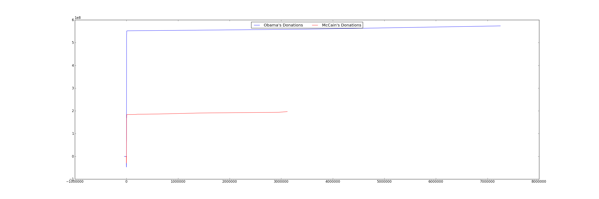

Only after we've verified that the small donations were the major contributors, is it safe to zoom in on the graph!  Use the ranges in the previous exercise.

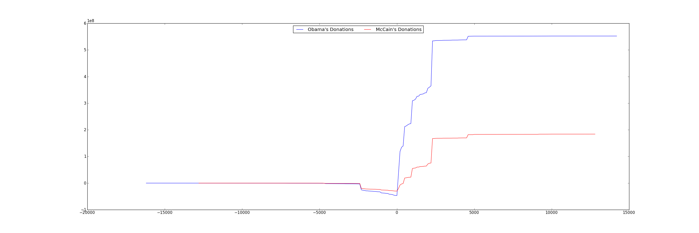

## Exercise 3: Scatter plots

Scatter plot of re-attribution by spouses for all candidates.  Find all re-attribution by spouses data points for each candidate and plot them on a scatter plot.  The x-axis is the donation date and the y-axis is the donation amount.   

<!--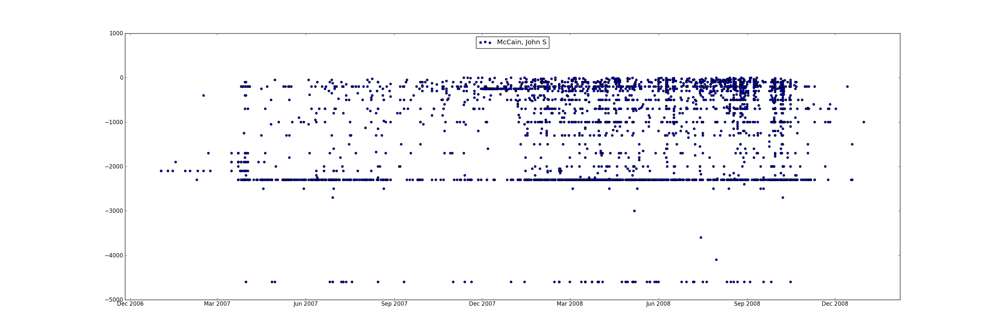-->

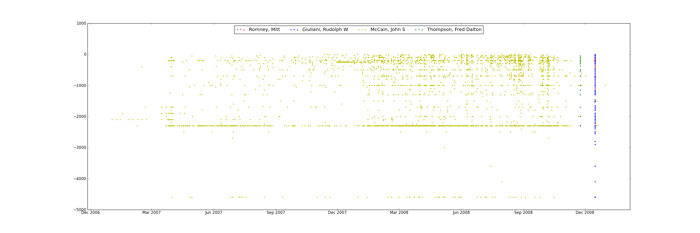

It seems to be concentrated in a small group of Republican candidates.

At this point, we've only scratched the surface of one dimension (reattributions) of this interesting dataset.  You could continue our investigation by correlating professions with candidates, visualize donations by geography, or see if there are any more suspicious and interesting data points.  

For example, which professions and companies are using this "re-attribution to spouse" trick?

Also, the 2012 campaign contributions are also [available on the website](http://fec.gov/disclosurep/PDownload.do), so you could use your analysis on the current election!

## Exercise 4

Now create a figure where each subgraph plots the total amount of per-state donations to a candidate.  Thus, if there are 5 candidates (for example), there would be 5 subplots.

The tricky part is mapping the donation amount to a color.  Here's some sample code to pick a shade of blue depending on the value of a donation between 0 and MAXDONATION.  The bigger index means a darker shade.
    
    # this creates an array of grey colors from white to black
    colors = ['0','1','2','3','4','5','6','7','8','9','a', 'b', 'c', 'd', 'e', 'f']
    colors = map(lambda s: '#%s' % (s*6), colors)
    colors.sort(reverse=True)

    # assume MAXDONATION was defined
    # assume curdonation is the donation to pick a color for
    ratio = (curdonation/float(MAXDONATION))
    color_idx = int( ratio * (len(colors) - 1) )
    colors[color_idx]

Using this, you should be able to create something like the following:

<a href="ex4_map.png">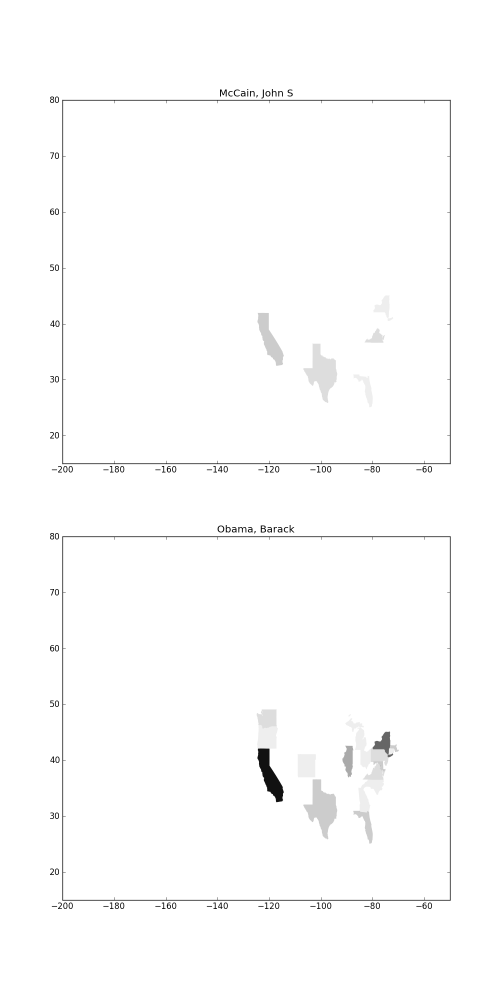</a>

You'll notice that if you plot more candidates, they are very difficult to see because their donations are eclipsed by Obama's.  One way is to use a log scale instead of a linear scale when mapping donations

Here's some sample code for computing a log

    import math
    math.log(100) # log of 100

<!--## Exercise 4:

Per-State amount on a map.  Tricky, need to pick proper mapping between data range and color range (probably research in this!)-->

<!--
## Exercise 4: Visualize County Health Data

The following are CSV files that contain the 2011 per-county health metrics.  The first three columns contain the FIPS county code, the state and the county.  The subsequent columns contain different metric values.  The first file contains only Years of Preventable Life Loss (YPLL) values, which is used as a proxy for the health of a population.  It is calculated as the sum of (Reference Age - Age at Death) for all deaths in a year.  The reference age is often 75.  The second file contains other metric values about each county.

* datasets/county_health_data/ypll.csv
* datasets/county_health_data/additional_measures_cleaned.csv

Visualize each of the following metrics on a map.  Vary each county's color by the metric value.

* YPLL Rate
* % Child Illiteracy
* % Free Lunch
* % High Housing Costs
* % Diabetes

Take a look at the data first.  There is a state-only row of data before data of the counties within the state.  You should ignore that row.  I personally use darker shades of blue to signify higher metric values.  Here's some code that picks the shade of blue depending on a metric's current, maximum, and minimum values.

    blues = ['#FFF7FB', '#ECE7F2', '#D0D1E6', '#A6BDDB', '#74A9CF',
             '#3690C0', '#0570B0', '#045A8D', '#023858']
    MAXVAL = ...
    MINVAL = ...
    coloridx = int(( (value - MINVAL) / (MAXVAL - MINVAL) ) * (len(blues)-1)) )

The final charts should look something like

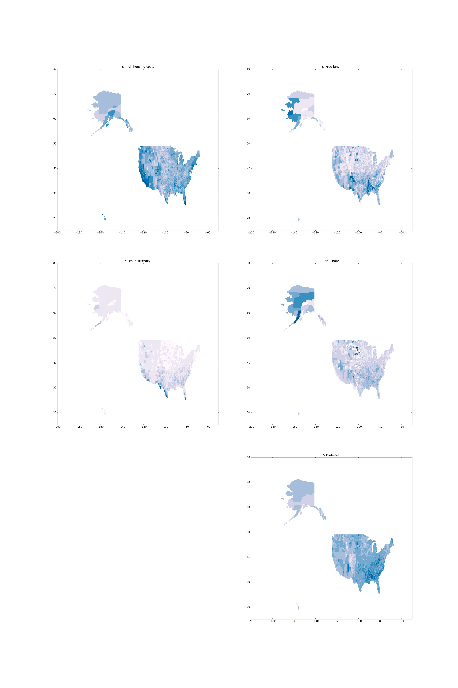

-->

# Done!

Now you have hands on experience with the most popular python plotting library!  `Matplotlib` is far more power than what we have covered.  To cover the general process of using visualizations:

* Always start by looking at your data with the simplest visualizations possible.  For most datasets, a scatter plot or line graph is sufficient.
* First view a summary of the whole dataset so that you know which subsets are worth visualizing in more detail, and how significant the details really are.
* Plot your interesting data along a bunch of different dimensions.
* Stare at your data, try to identify trends, outliers and other interesting regions and form hypotheses.
* Use statistics to see if your hypotheses were correct (tomorrow's lecture)
* Repeat

### Domain specific visualizations

We only covered a small number of core visualizations in this lab.  There are lots of other types of visualizations specialized for different domains.  A few of them are listed below.

<b>Gene Expression Matrix</b> 
Gene expression matrixes can be used to show correlations between genes and properties of patients.  Here is one: 
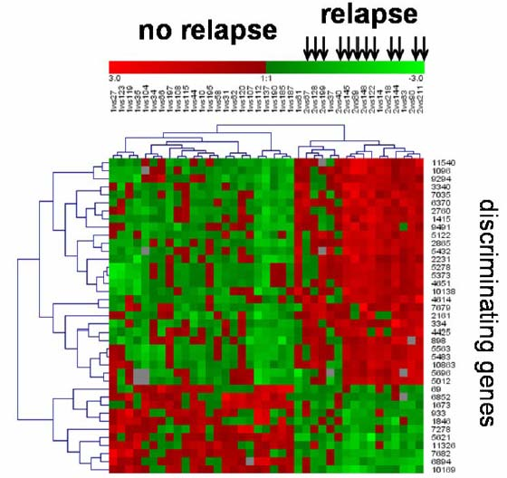

<b>Network Graphs</b> 
Plotting [graphs of social networks](http://infosthetics.com/archives/facebook_graph2.jpg) is a topic unto itself, and isn't well supported in `matplotlib`.  There are other libraries for drawing them, but we unfortunately don't have the time to talk about it in this class.  If you're interested, one useful network graphing library is [NetworkX](http://networkx.lanl.gov/).  Here's an example of a network graph overlayed on a map: 
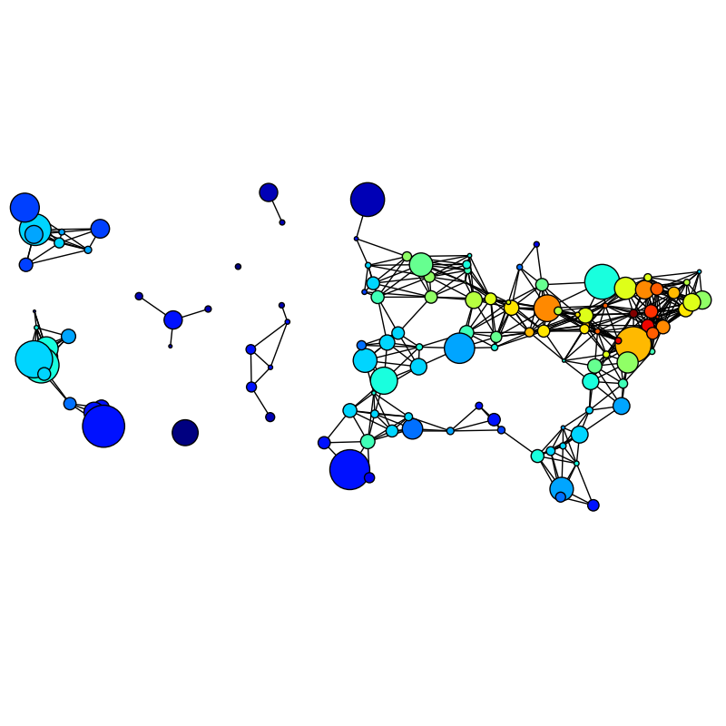

<b>TreeMaps</b> 
A Treemap helps summarize relative proportions of a whole.  Here's a [treemap of financial markets](http://www.smartmoney.com/map-of-the-market/).  You can make [treemaps in matplotlib](http://www.scipy.org/Cookbook/Matplotlib/TreeMap). 
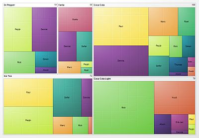

#### Other visualization tools

Some other visualization tools.  A few are in python, and many are in other languages like javascript or java.

* [http://orange.biolab.si/features.html](http://orange.biolab.si/features.html): visualization and machine learning package for python
* [Processing](http://processing.org/): a fantastic java-based visualization language.
* [ProcessingJs](http://processingjs.org/): Processing ported to javascript
* [d3](http://mbostock.github.com/d3/): A javascript based visualization library that makes drawing on `canvas` much much easier.

# Feedback

<iframe src="https://docs.google.com/spreadsheet/embeddedform?formkey=dGtOSW5fd3l4eVFtRDNPYTZPWHJPM1E6MQ" width="760" height="939" frameborder="0" marginheight="0" marginwidth="0">Loading...</iframe>